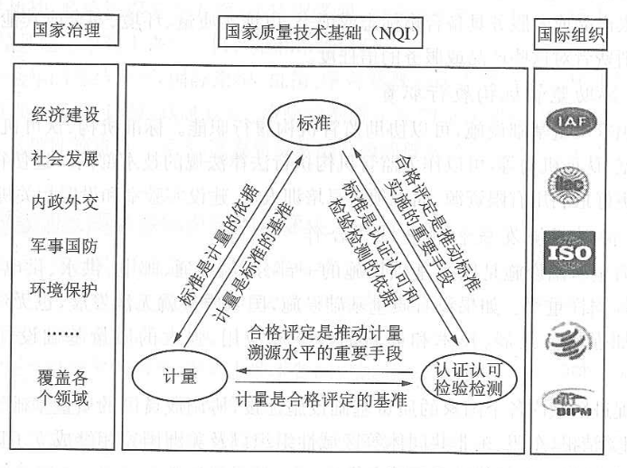

# 三、国家质量基础设施的内涵

## (一)国家质量基础设施的基本特性
- 影响质量的因素也很多,包括技术创新、居民收入、外国投资、法律制度、劳动力技能等,其中关键影响因素就是质量基础设施。质量基础设施是指一个国家和地区建立和执行计量、标准、认证认可、检验检测(后两者合称为合格评定)等所需质量体制机制框架的统称,既包括法规体系、管理体系等“软件”设施,也包括检验检测仪器设备、实验室等“硬件”设施,具有技术、生产和贸易等三重属性。国家质量基础设施的基本特性如表2-1所示。  

| 要素 | 技术属性 | 生产属性 | 贸易属性 |
| --- | ---  | --- |  --- |
| 计量 | 主要解决单位制的统一和量值传递准确可靠 | 推动社会化大生产从经验走向科学 | 促进贸易达成的前提和基础 |
| 标准 | 主要解决量的统一性 | 深化社会化大生产的分工与专业程度 | 建立最佳贸易秩序的基本准则 |
| 认证认可 | 主要解决量的公允性 | 提升社会化大生产组织的质量保障水平 | 推动贸易便利化的重要工具 |
| 检验检测 | 主要解决量的符合性 | 提升社会化大生产产品与服务质量水平 | 推动贸易便利化的重要工具 |

- 从国家质量基础设施概念的产生和发展过程来看,国家质量基础设施还具有系统性、技术性、制度性、基础性、国际性等多重属性。

## (二)国家质量基础设施要素的关系
- 质量基础设施主要包括计量、标准、认证认可、检验检测等四个要素。图2-1是国际普遍认可的质量基础设施框架,可以看出计量、标准、认证认可、检验检测各要素之间相互作用和相互支撑,构成一个完整的技术链条,并通过企业综合作用于产业整个价值链。
- 
